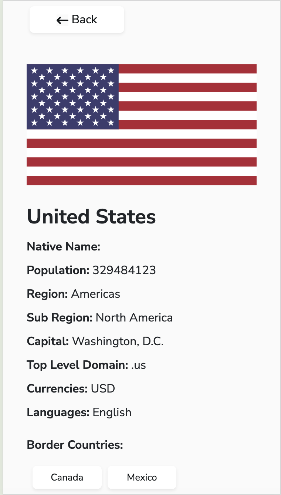

# REST Countries API with color theme switcher 

## Table of contents

- [Overview](#overview)
  - [Functionality](#functionality)
  - [Screenshot](#screenshot)
  - [Links](#links)
  - [Available scripts](#available-scripts)
- [Author](#author)

<!-- ## TO DO

- dark/light theme
-  add display 20 and next button to flagslist
- format population number
- fix border countries buttons -->

## Overview

### Functionality

Use this application to:

- See all countries from the API on the homepage
- Search for a country using an `input` field
- Filter countries by region
- Click on a country to see more detailed information on a separate page
- Click through to the border countries on the detail page
- Toggle the color scheme between light and dark mode 

### Screenshot

Desktop view:

Mobile view:

### Links

- Solution URL: [Github](https://github.com/cvtqx/countries-and-flags)
- Live Site URL: [https://countries-and-flags.onrender.com/](https://countries-and-flags.onrender.com/)

### Built with

- React
- React - Bootstrap
- Responsive design
- React Router

## Available Scripts

In the project directory, you can run:

### `npm start`

Runs the app in the development mode.\
Open [http://localhost:3000](http://localhost:3000) to view it in your browser.

The page will reload when you make changes.

## Author

- Website - [Portfolio](https://www.olgayudkin.com)
- LinkedIn - [LinkedIn](https://www.linkedin.com/in/olga-yudkin/)

